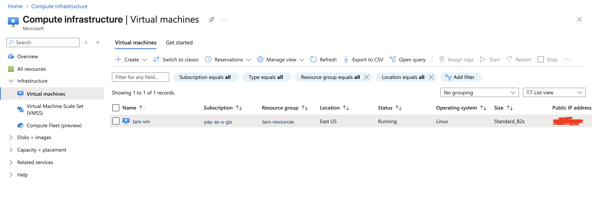

<!-- TARS Logo -->
<p align="center">
  
</p>

# tars-multi-ai-agent
TARS Multi AI Agent System

---

# Table of Contents
- [Project Overview](#project-overview)
  - [Problem Statement & Solution](#problem-statement--solution)
- [Architecture](#architecture)
  - [System Deployment & Flow](#system-deployment--flow)
  - [Microsoft AI Foundry Integration](#microsoft-ai-foundry-integration)
  - [Azure VM Deployment](#azure-vm-deployment)
  - [Front-end Deployment on Vercel](#front-end-deployment-on-vercel)
  - [High-Level AI Agent Architecture](#high-level-ai-agent-architecture)
  - [Agent Orchestration & Roles](#agent-orchestration--roles)
- [Project Structure](#project-structure)
- [Tech Stack](#tech-stack)
- [Deployment Guide](#deployment-guide)
  - [Front-End Deployment](#front-end-deployment)
  - [Back-End Deployment on Azure VM](#back-end-deployment-on-azure-vm)
  - [Infrastructure Deployment with Terraform](#infrastructure-deployment-with-terraform)
- [How It Works](#how-it-works)
- [Key Features](#key-features)
- [Collaborators](#collaborators)
- [Future Improvements](#future-improvements)
- [Disclaimer](#disclaimer)

---

# Project Overview
TARS Multi-Agent System is a platform for business process optimization using a multi-agent AI architecture. It consists of a Next.js front-end, a FastAPI back-end, and Terraform-managed Azure infrastructure. The system leverages Microsoft AI Foundry, A2A, and MCP for advanced AI capabilities.

## Problem Statement & Solution
<p align="center">
  
</p>

This illustration highlights the business pain points (siloed data, slow manual analysis) and how TARS unifies internal and external data for actionable, real-time recommendations.

# Architecture

## System Deployment & Flow
<p align="center">
  
</p>

This diagram shows how the front-end (deployed on Vercel) communicates with the back-end FastAPI service running in a Docker container on an Azure VM. The back-end orchestrates agent logic, calls to Microsoft AI Foundry, and MCP (Brave Search, Firecrawl, Tavily).

### Microsoft AI Foundry Integration
<p align="center">
  
</p>

The TARS system integrates with Microsoft AI Foundry, accessing the ContosoDataV2:1 dataset containing organizational documents structured in various departments including Finance, Operations, Policy, Procurement, Sales, and Strategic departments. This data provides the internal knowledge base that powers Agent 1's enterprise knowledge capabilities.

### Azure VM Deployment
<p align="center">
  
</p>

Azure VM running the TARS multi-agent backend in a Docker container, with Standard_B2s size and Linux OS in East US region, managed through pay-as-u-go subscription.

### Front-end Deployment on Vercel
<p align="center">
  
</p>

The front-end is deployed on Vercel's platform, with automated CI/CD from the main branch, providing high availability and scaling capabilities.

## High-Level AI Agent Architecture
<p align="center">
  
</p>

This architecture details the flow between SharePoint/Fabrics, the five agents (Enterprise Knowledge, Global Intelligence, Consultant, Outcome Predictor, Informant), and how outputs are structured for the front-end.

## Agent Orchestration & Roles
<p align="center">
  
</p>

This diagram shows the A2A (Agent-to-Agent) orchestration, the role of the Strategic Analyst Agent as orchestrator, and the division between knowledge agents and action agents.

# Project Structure
The repository is organized into three main folders:

### 1. Front-End
- **Framework**: Next.js with TypeScript and Redux
- **Deployment**: Vercel
- **Purpose**: Provides an interactive user interface for managing agent workflows, chat interactions, and displaying optimization results.
- **Key Features**:
  - Agent workflow visualization
  - Chat interface for user queries
  - Output interface for analytics, recommendations, and business flow visualizations

### 2. Back-End
- **Framework**: FastAPI
- **Purpose**: Implements the agent logic, abstraction layers, and integrations with Microsoft AI Foundry, A2A, and MCP.
- **Key Features**:
  - Multi-agent coordination through a centralized process manager
  - Dockerized for deployment
  - Handles API requests for optimization queries

### 3. Infrastructure
- **Tool**: Terraform
- **Purpose**: Provisions Azure Virtual Machines to host the back-end service.
- **Key Features**:
  - Automates infrastructure setup
  - Pulls and runs Docker images for the back-end service

## Architecture

### Back-end Architecture
The back-end is a FastAPI application that:
- Coordinates multiple agents through a centralized process manager
- Implements agent logic for tasks such as retrieving internal knowledge, performing external searches, and generating recommendations
- Provides a standardized API for front-end interaction
```
┌─────────────────────────────────────────────────────────────────────┐
│                       FastAPI Application                            │
│                                                                     │
│  ┌─────────────┐       ┌─────────────────┐      ┌───────────────┐   │
│  │  API Routes │───────▶ Process Manager │─────▶│ Response      │   │
│  │  /optimize  │       │ (Orchestrator)  │      │ Formatter     │   │
│  └─────────────┘       └─────────────────┘      └───────────────┘   │
│          │                     │                        ▲           │
│          │                     ▼                        │           │
│          │      ┌───────────────────────────────────────┐           │
│          │      │            Agent Pipeline             │           │
│          │      │  ┌─────┐  ┌─────┐  ┌─────┐  ┌─────┐   │           │
│          │      │  │  1  │─▶│  3  │─▶│  4  │─▶│  5  │   │           │
│          │      │  └─────┘  └─────┘  └─────┘  └─────┘   │           │
│          │      │     ▲        │                        │           │
│          │      │     │        ▼                        │           │
│          │      │  ┌─────┐                              │           │
│          │      │  │  2  │                              │           │
│          │      │  └─────┘                              │           │
│          │      └───────────────────────────────────────┘           │
│          │                                                          │
│          │                                                          │
│          ▼                                                          │
│  ┌─────────────┐                                                    │
│  │ Monitoring  │                                                    │
│  │ & Logging   │                                                    │
│  └─────────────┘                                                    │
└─────────────────────────────────────────────────────────────────────┘
```


### Front-End
The front-end is built with Next.js and TypeScript, leveraging Redux for state management. It provides a responsive and interactive interface for:
- Submitting optimization queries
- Visualizing agent workflows
- Displaying analytics and recommendations


### Infrastructure
The infrastructure is managed using Terraform, which:
- Provisions Azure Virtual Machines
- Deploys the back-end service as a Docker container

## Tech Stack
- **Front-End**: Next.js, TypeScript, Redux, Tailwind CSS
- **Back-End**: FastAPI, Azure AI Agent Service, Python, Docker
- **Infrastructure**: Terraform, Azure VM
- **AI Platform & Infrastructure**: Microsoft AI Foundry
- **MCP**: Brave Search, Firecrawl

## Deployment Guide

### Front-End Deployment
Deployed on Vercel for seamless CI/CD and scalability.

### Back-End Deployment on Azure VM

#### Prerequisites
1. Ensure you have access to an Azure Virtual Machine.
2. Install Docker on the VM.
3. Obtain the public IP address of the VM.

#### Steps
1. SSH into the Azure VM:
   ```bash
   ssh -i ~/.ssh/tars_azure azureuser@YOUR_VM_PUBLIC_IP
   ```

2. Pull the Docker image:
   ```bash
   docker pull haziqishere/tars-multi-agent:v3.1-amd64
   ```

3. Run the Docker container:
   ```bash
   sudo docker run -d -p 80:80 --platform=linux/arm64/v8 haziqishere/tars-multi-agent:v3.1-amd64
   ```

4. Verify the container is running:
   ```bash
   docker ps
   ```

5. Access the application via the VM's public IP address in a browser.

### Infrastructure Deployment with Terraform

#### Prerequisites
1. Install Terraform on your local machine.
2. Configure Azure CLI and authenticate.

#### Steps
1. Navigate to the `infra-tars` directory:
   ```bash
   cd infra-tars
   ```

2. Initialize Terraform:
   ```bash
   terraform init
   ```

3. Apply the Terraform configuration:
   ```bash
   terraform apply
   ```

4. Confirm the resources have been provisioned successfully.

## How It Works
1. **User Interaction**: Users interact with the front-end to submit queries.
2. **Agent Coordination**: The back-end processes the query through a pipeline of agents.
3. **Optimization Results**: The results are displayed on the front-end, including analytics, recommendations, and visualizations.

## Key Features
- Multi-agent coordination for complex business process optimization
- Integration with Microsoft AI Foundry, A2A, and MCP
- Scalable and modular architecture

## Collaborators
- **Haziq**: MLOps Engineer
- **Ilham**: AI Engineer

## Future Improvements
- Enhance agent logic with more advanced AI models
- Improve front-end interactivity and visualizations
- Automate deployment pipelines for faster updates

## Disclaimer 
- We ARE fetching this from the currently running server at Azure VM
- However, Agent 4 sometimes goes wrong and we're not getting emails data. So we backfill the missing email params.
- The rest of the data are real from Azure VM that communicate with Microsoft AI Foundry (which the document data is located)
